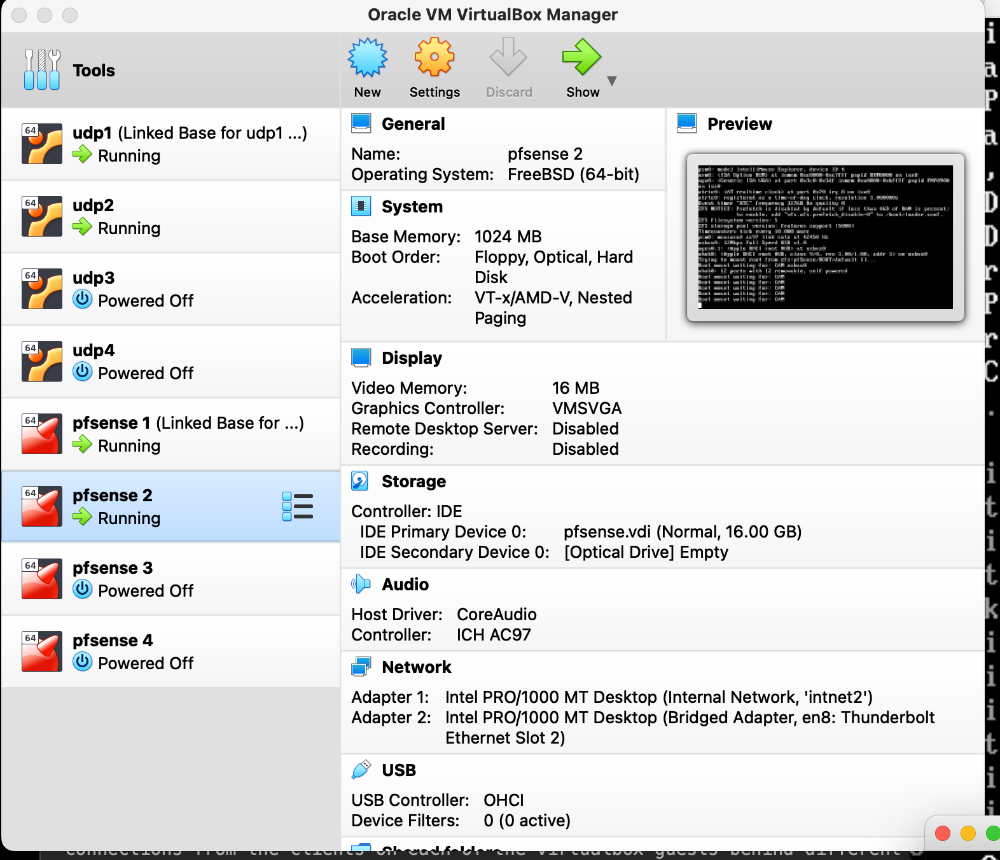

# NAT Punchthrough for TugBoat / FishNet

NAT punch server based on LiteNetLib for TugBoat/Fishnet use.  Example command line client included for experimentation and testing.

Implementing: [STUN/TURN/ICE](https://anyconnect.com/stun-turn-ice/), but without the relay fallback.  Future plans are to create a relay server as well and add fallback.

### Dependency
https://github.com/RevenantX/LiteNetLib
## Proposed Approach

1. <del>Done: Create a standalone NAT Punchthrough Server based on LiteNetLib</del>
1. <del>Done: Create a client for testing</del>
1. <del>Done: Manually test multiple game servers and clients.</del>
1. Create Tests against the punchthrough server that:
	- Test multiple clients
	- Test multiple session keys
	- validate traffic can pass
1. Create a client library that aligns with the TugBoat transport
1. Create a Unity project that uses this library
1. embed this in TugBoat


## Getting started doing dev

The repo is organized as a Solution, with multiple projects.  It should import into any C# IDE without a problem.  

- Please .gitignore your IDE poop
- Build however you like building 
	- ```dotnet build``` from the project root works just fine
- Run the Facillitator either in your IDE or via command line
	1. ```cd NATPunchServer```
	1. ```dotnet run NATPunchServer -- <serverPort> <serverAddress>```
	1. *or run with defaults:* ```dotnet run NATPunchServer```

- Run the client either in your idea or via command line
	- you must run at least two clients with the same token, on in client mode the other in game server mode, to see the punchthrough conversation happen
	- command line 
		- ```dotnet run NATPunchClient -- <gameToken> <server|client> <optional:serverPort> <optional:serverAddress>```
		- defaults are in the code and may change, run without arguments for defaults
		- The arguements are optionsl, but you must include the arguements in the stated order

## Setting up a test environment using VirtualBox NAT Networks

You can set up multiple [VirtualBox](https://www.oracle.com/virtualization/virtualbox/) VMs, each using connection type of 'Nat Network', different NAT Networks for each VM and run your Faccilitator on your regular host to similate things.  You can then make connections from the clients on each of the virtualbox guests behind different NAT Networks to that facilitator.

[Decent Guide to setting up NAT Networks using VirtualBox](https://www.techbeatly.com/how-to-create-and-use-natnetwork-in-virtualbox/)

How I do it:

- use ubuntu linux server and the command line mode for the clients for testing.
- create n number of NAT Networks with different network ip blocks
- create a base disk image with dotnet and base vm to clone
- clone the base vm using linked n times.
- assign a different NAT Network to each of the vms




	
## Resources:
- [https://github.com/RevenantX/LiteNetLib/blob/master/LibSample/HolePunchServerTest.cs](https://github.com/RevenantX/LiteNetLib/blob/master/LibSample/HolePunchServerTest.cs)
- [https://anyconnect.com/stun-turn-ice/](https://anyconnect.com/stun-turn-ice/)
- [https://mirror-networking.gitbook.io/docs/transports/litenetlib-transport](https://mirror-networking.gitbook.io/docs/transports/litenetlib-transport)
- [https://www.atmosera.com/blog/creating-a-daemon-with-net-core-part-1/](https://www.atmosera.com/blog/creating-a-daemon-with-net-core-part-1/)
